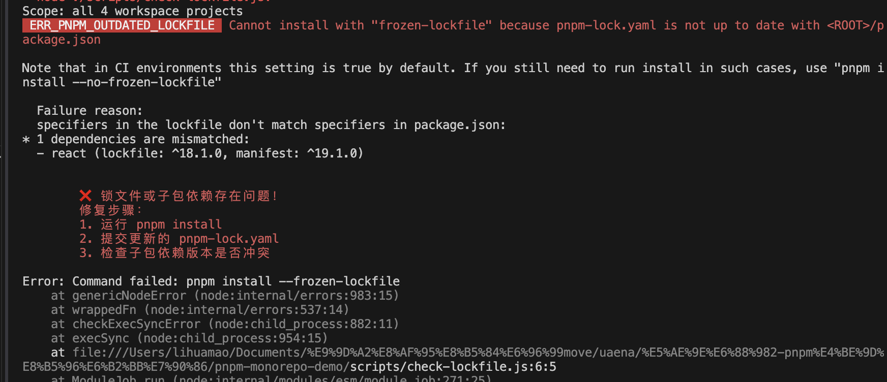

## demo
1. 创建项目结构
2. 配置 workspace
3. 创建子项目 {app1,app2} 

## 制造问题
1. 添加重叠依赖（故意制造问题）
    - 大版本相同的重叠依赖：app1 app2 中 分别添加  lodash@4.17.0 lodash@4.16.0
    - 添加多版本依赖
        <!-- app1 添加 axios@0.21.1；
        app1 添加 axios@1.0.0； -->
3. 添加无用依赖
    app1 添加 moment
4. 创建根目录冗余依赖
    pnpm add -w eslint typescript webpack

## 解决问题
### 重叠/公共依赖
    - 提升到根目录：
    疑问：提升依赖时，版本号如何确定？
    - 移除子目录的重复依赖
    疑问：如何确定哪些是重复依赖？
    - 统一版本
    疑问：上述命令能否写入脚本？
### 无用依赖：
    - 检测并删除
        - 根目录 pnpm add -wD depcheck && npx depcheck 找到未使用的运行和开发时依赖
             - -w, --workspace-root 参数，可以将依赖包安装到工程的根目录下，作为所有 package 的公共依赖。
             - -D 参数，表示这是一个开发依赖，会装到 pacakage.json 中的 devDependencies 中，比如：
    - 结果：控制台输出
        Unused dependencies
        * typescript
        Unused devDependencies
        * depcheck
        * webpack
        * eslint

### 锁文件一致性
#### 前置条件：限制node、pnpm版本一致
1. 在 package.json 中通过 engines 字段声明，设置版本：
#### 本地提交保证
https://pnpm.io/zh/cli/install#--frozen-lockfile

1. 安装husky
pnpm add -D lint-staged husky
npx husky init 
2. 书写脚本 check-lockfile.js
child_process: https://nodejs.cn/api/child_process.html#child_processexecsynccommand-options
- 脚本中使用 child_process.execSync（同步执行命令）而不是异步方法（如 exec），主要是出于以下几个关键原因：
    - 脚本逻辑需要阻塞式执行：如果用异步 exec，脚本可能在检查完成前就退出了（导致漏检）
    - 与 Git Hooks 的集成：pre-commit 等钩子需要同步返回结果（成功=0，失败≠0）来决定是否继续提交。
- stdio:设置inherit
    - 作用：将子进程的输入/输出流直接绑定到父进程。（你的 Node.js 脚本）
    - 效果：会在运行脚本的终端中实时看到 pnpm install 的输出（如安装进度、错误信息等）。
2.1 修改package.json的版本号，不执行pnpm install，使得锁文件未更新。
3. 在 package.json 中，配置lint-staged命令

4. 设置 Git Hook:
通过 Husky 在 pre-commit 阶段触发 lint-staged：npx husky add .husky/pre-commit "npx lint-staged"

##### 测试
1. 修改根目录package.json的版本号，不执行pnpm install，使得锁文件未更新。
执行git commit，得到



## 知识补充
### 项目的模块模式
取决于：package.json 的 "type" 字段
    ```js
    {
    "type": "module"  // 所有 .js 文件视为 ESM
    // 或
    "type": "commonjs" // 所有 .js 文件视为 CJS（默认）
    }
    ```
### 几种寻找根目录的方式
    - 递归查找。原理：在 Monorepo 中，根目录可能有 pnpm-workspace.yaml、lerna.json 等标志文件。
    - 结合 __dirname 和固定层级回退。原理：假设脚本在项目中的固定层级（如 scripts/ 子目录），通过 path.join(__dirname, '../..') 回退。
    - 使用环境变量（需提前设置）


### 工具链
#### lint-staged
安装方式：

#### husky
git hooks和脚本的关系是父子进程？

## 过程中遇到的问题


